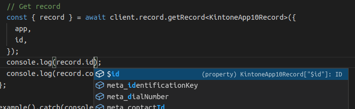

# kintone-form-model-generator

  

Generate type definitions compatible with [@kintone/rest-api-client](https://github.com/kintone/js-sdk/tree/master/packages/rest-api-client#readme)



## Prerequirements

- Node.js (>=12)

## Install

```sh
# Install
npm install -g kintone-form-model-generator

# npx
npx kintone-form-model-generator
```

## Usage

### Generate

```sh
# Generate all models
kintone-form-model-generator generate

# Specify app ids (or -a option)
kintone-form-model-generator generate --app-ids=1,5,10
```

By default, files are generated in the `out/` directory.

```ts:example.ts
import { ID, Revision } from "@kintone/rest-api-client/lib/KintoneFields/types/field";

export interface KintoneApp1Record {
  /**
  * ID
  * @type ID
  */
  "$id": ID;
  /**
  * Revision
  * @type Revision
  */
  "$revision": Revision;
  /**
   * チェックボックス
   * CHECK_BOX
   * @type CheckBox
   */
  "チェックボックス": CheckBox;
  /**
   * テーブル
   * @type Subtable
   */
  "テーブル": Subtable<{
    /**
     * 文字列 (1行)
     * 文字列__1行__Table
     * SINGLE_LINE_TEXT
     * @type SingleLineText
     */
    "文字列__1行__Table": SingleLineText;
  }>;
}

export type KintoneApp54RecordForParameter = KintoneApp54RecordForParameterStrict & ForParameterLax;

export type ForParameterLax = {
    [fieldCode: string]: {
        value: unknown;
    };
};

export interface KintoneApp54RecordForParameterStrict {
  /**
   * チェックボックス
   * CHECK_BOX
   * @type Object
   */
  "チェックボックス"?: {
    value: string[];
  };
  /**
   * テーブル
   * SUBTABLE
   * @type Object
   */
  "テーブル"?: {
    value: {
      /**
       * id
       * @type string
       */
      id: string;
      value: {
        /**
         * 文字列 (1行)
         * 文字列__1行__Table
         * SINGLE_LINE_TEXT
         * @type SingleLineText
         */
        "文字列__1行__Table"?: {
          value: string;
        };
      };
    }[];
  };
}
```

## Configuration

### Environments variables

Specify secrets in the environment variables.

| Name             | Description                                             |
| ---------------- | ------------------------------------------------------- |
| KINTONE_BASE_URL | URL for kintone (ex. `https://your-domain.cybozu.com` ) |
| KINTONE_USERNAME | Kintone username                                        |
| KINTONE_PASSWORD | Kintone apssword                                        |

### Configuration

Specify detailed behavior by `--config` or `-c` option. (Must be `utf-8` encoded JSON file.)

```sh
kintone-form-model-generator generate --config=config.json
```

| Name                           | Type                   | Default   | Description                                                   |
| ------------------------------ | ---------------------- | --------- | ------------------------------------------------------------- |
| outDir                         | string                 | `out/`    | Output directory                                              |
| modelNaming                    | string                 | `appId`   | `appId` or `appCode`                                          |
| modelNameMapping               | Record<string, string> | {}        | A dictionary object with a model name using `appId` as a key. |
| modelNamePrefix                | string                 | `Kintone` | Model name prefix                                             |
| modelNameSuffix                | string                 | `Record`  | Model name suffix                                             |
| modelNamingDuplicationStrategy | string                 | `error`   | `error` or `skip` or `uniquifyWithAppId`                      |
| ignoreAppIds                   | Array<string>          | []        | ignore app id list                                            |

Example:

```json
{
  "outDir": "dist/",
  "modelNameMapping": {
    "1": "Customer",
    "3": "Sales"
  },
  "modelNamePrefix": "My",
  "modelNameSuffix": "Record",
  "ignoreAppIds": ["2"]
}
```

### Kintone API configuration

Specify the connection to Kintone API with `--kintone-config` or `-k` option. (Must be `utf-8` encoded JSON file.)

See more details in [@kintone/rest-api-client](https://github.com/kintone/js-sdk/tree/master/packages/rest-api-client#parameters-for-kintonerestapiclient) repository.

```sh
kintone-form-model-generator generate --kintone-config=kintone-config.json
```

Example:

```json
{
  "baseUrl": "https://your-domain.cybozu.com",
  "auth": {
    "apiToken": "your-api-token"
  }
}
```
