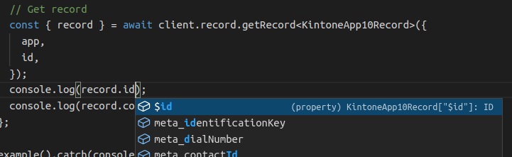

# kintone-form-model-generator

  

Generate type definitions compatible with [@kintone/rest-api-client](https://github.com/kintone/js-sdk/tree/master/packages/rest-api-client#readme)



## Prerequirements

- Node.js (>=12)

## Install

```sh
# Install
npm install -g kintone-form-model-generator

# npx
npx kintone-form-model-generator
```

## Usage

### Generate

```sh
# Generate all models
kintone-form-model-generator generate

# Specify app ids (or -a option)
kintone-form-model-generator generate --app-ids=1,5,10
```

By default, files are generated in the `out/` directory.

```ts:example.ts
import { ID, Revision } from "@kintone/rest-api-client/lib/KintoneFields/types/field";

export interface KintoneApp1Record {
  /**
  * ID
  * @type ID
  */
  "$id": ID;
  /**
  * Revision
  * @type Revision
  */
  "$revision": Revision;
  /**
   * チェックボックス
   * CHECK_BOX
   * @type CheckBox
   */
  "チェックボックス": CheckBox;
  /**
   * テーブル
   * @type Subtable
   */
  "テーブル": Subtable<{
    /**
     * 文字列 (1行)
     * 文字列__1行__Table
     * SINGLE_LINE_TEXT
     * @type SingleLineText
     */
    "文字列__1行__Table": SingleLineText;
  }>;
}

export type KintoneApp54RecordForParameter = KintoneApp54RecordForParameterStrict & ForParameterLax;

export type ForParameterLax = {
    [fieldCode: string]: {
        value: unknown;
    };
};

export interface KintoneApp54RecordForParameterStrict {
  /**
   * チェックボックス
   * CHECK_BOX
   * @type Object
   */
  "チェックボックス"?: {
    value: string[];
  };
  /**
   * テーブル
   * SUBTABLE
   * @type Object
   */
  "テーブル"?: {
    value: {
      /**
       * id
       * @type string
       */
      id: string;
      value: {
        /**
         * 文字列 (1行)
         * 文字列__1行__Table
         * SINGLE_LINE_TEXT
         * @type SingleLineText
         */
        "文字列__1行__Table"?: {
          value: string;
        };
      };
    }[];
  };
}
```

## Configuration

### Environments variables

Specify secrets in the environment variables.

| Name             | Description                                             |
| ---------------- | ------------------------------------------------------- |
| KINTONE_BASE_URL | URL for kintone (ex. `https://your-domain.cybozu.com` ) |
| KINTONE_USERNAME | Kintone username                                        |
| KINTONE_PASSWORD | Kintone apssword                                        |

### Configuration

Specify detailed behavior by `--config` or `-c` option. (Must be `utf-8` encoded JSON file.)

```sh
kintone-form-model-generator generate --config=config.json
```

| Name                           | Type                   | Default   | Description                                                   |
| ------------------------------ | ---------------------- | --------- | ------------------------------------------------------------- |
| outDir                         | string                 | `out/`    | Output directory                                              |
| modelNaming                    | string                 | `appId`   | `appId` or `appCode`                                          |
| modelNameMapping               | Record<string, string> | {}        | A dictionary object with a model name using `appId` as a key. |
| modelNamePrefix                | string                 | `Kintone` | Model name prefix                                             |
| modelNameSuffix                | string                 | `Record`  | Model name suffix                                             |
| modelNamingDuplicationStrategy | string                 | `error`   | `error` or `skip` or `uniquifyWithAppId`                      |
| ignoreAppIds                   | Array<string>          | []        | ignore app id list                                            |

Example:

```json
{
  "outDir": "dist/",
  "modelNameMapping": {
    "1": "Customer",
    "3": "Sales"
  },
  "modelNamePrefix": "My",
  "modelNameSuffix": "Record",
  "ignoreAppIds": ["2"]
}
```

### Kintone API configuration

Specify the connection to Kintone API with `--kintone-config` or `-k` option. (Must be `utf-8` encoded JSON file.)

See more details in [@kintone/rest-api-client](https://github.com/kintone/js-sdk/tree/master/packages/rest-api-client#parameters-for-kintonerestapiclient) repository.

```sh
kintone-form-model-generator generate --kintone-config=kintone-config.json
```

Example:

```json
{
  "baseUrl": "https://your-domain.cybozu.com",
  "auth": {
    "apiToken": "your-api-token"
  }
}
```

## tips

If you want to use the generated type definitions more conveniently, try this!
  
<details>
  
```ts
import { Record } from "@kintone/rest-api-client/lib/client/types";
import {
  RecordNumber,
  ID,
  Revision,
  Creator,
  CreatedTime,
  Modifier,
  UpdatedTime,
  SingleLineText,
  MultiLineText,
  RichText,
  Number as KintoneNumber,
  Calc,
  CheckBox,
  RadioButton,
  MultiSelect,
  Dropdown,
  UserSelect,
  OrganizationSelect,
  GroupSelect,
  Date as KintoneDate,
  Time,
  DateTime,
  Link,
  File,
  Category,
  Status,
  StatusAssignee,
  Subtable,
  InSubtable,
} from "@kintone/rest-api-client/lib/KintoneFields/types/field";
import dayjs from "dayjs";
import { ForParameterLax, KintoneContactRecord } from "~/kintone/models";

type KeysMatching<T, V> = keyof {
  [P in keyof T as T[P] extends V ? P : never]: unknown;
} &
  keyof T;

class KintoneRecordParser<T extends Record> {
  public constructor(private record: T) {}

  public getRecordNumberField(
    fieldCode: KeysMatching<T, RecordNumber>
  ): RecordNumber {
    const field = this.record[fieldCode];
    if (field.type === "RECORD_NUMBER") {
      return field;
    } else {
      throw new Error(`invalid field type: ${field.type}`);
    }
  }
  public getRecordNumberFieldValue(fieldCode: KeysMatching<T, RecordNumber>) {
    return this.getRecordNumberField(fieldCode).value;
  }

  public getIDField(fieldCode: KeysMatching<T, ID>): ID {
    const field = this.record[fieldCode];
    if (field.type === "__ID__") {
      return field;
    } else {
      throw new Error(`invalid field type: ${field.type}`);
    }
  }
  public getIDFieldValue(fieldCode: KeysMatching<T, ID>) {
    return this.getIDField(fieldCode).value;
  }

  public getRevisionField(fieldCode: KeysMatching<T, Revision>): Revision {
    const field = this.record[fieldCode];
    if (field.type === "__REVISION__") {
      return field;
    } else {
      throw new Error(`invalid field type: ${field.type}`);
    }
  }
  public getRevisionFieldValue(fieldCode: KeysMatching<T, Revision>) {
    return this.getRevisionField(fieldCode).value;
  }

  public getCreatorField(fieldCode: KeysMatching<T, Creator>): Creator {
    const field = this.record[fieldCode];
    if (field.type === "CREATOR") {
      return field;
    } else {
      throw new Error(`invalid field type: ${field.type}`);
    }
  }
  public getCreatorFieldValue(fieldCode: KeysMatching<T, Creator>) {
    return this.getCreatorField(fieldCode).value;
  }

  public getCreatedTimeField(
    fieldCode: KeysMatching<T, CreatedTime>
  ): CreatedTime {
    const field = this.record[fieldCode];
    if (field.type === "CREATED_TIME") {
      return field;
    } else {
      throw new Error(`invalid field type: ${field.type}`);
    }
  }
  public getCreatedTimeFieldValue(fieldCode: KeysMatching<T, CreatedTime>) {
    return dayjs(this.getCreatedTimeField(fieldCode).value).toDate();
  }

  public getModifierField(fieldCode: KeysMatching<T, Modifier>): Modifier {
    const field = this.record[fieldCode];
    if (field.type === "MODIFIER") {
      return field;
    } else {
      throw new Error(`invalid field type: ${field.type}`);
    }
  }
  public getModifierFieldValue(fieldCode: KeysMatching<T, Modifier>) {
    return this.getModifierField(fieldCode).value;
  }

  public getUpdatedTimeField(
    fieldCode: KeysMatching<T, UpdatedTime>
  ): UpdatedTime {
    const field = this.record[fieldCode];
    if (field.type === "UPDATED_TIME") {
      return field;
    } else {
      throw new Error(`invalid field type: ${field.type}`);
    }
  }
  public getUpdatedTimeFieldValue(fieldCode: KeysMatching<T, UpdatedTime>) {
    return dayjs(this.getUpdatedTimeField(fieldCode).value).toDate();
  }

  public getSingleLineTextField(
    fieldCode: KeysMatching<T, SingleLineText>
  ): SingleLineText {
    const field = this.record[fieldCode];
    if (field.type === "SINGLE_LINE_TEXT") {
      return field;
    } else {
      throw new Error(`invalid field type: ${field.type}`);
    }
  }
  public getSingleLineTextFieldValue(
    fieldCode: KeysMatching<T, SingleLineText>
  ) {
    return this.getSingleLineTextField(fieldCode).value;
  }

  public getMultiLineTextField(
    fieldCode: KeysMatching<T, MultiLineText>
  ): MultiLineText {
    const field = this.record[fieldCode];
    if (field.type === "MULTI_LINE_TEXT") {
      return field;
    } else {
      throw new Error(`invalid field type: ${field.type}`);
    }
  }
  public getMultiLineTextFieldValue(fieldCode: KeysMatching<T, MultiLineText>) {
    return this.getMultiLineTextField(fieldCode).value;
  }

  public getRichTextField(fieldCode: KeysMatching<T, RichText>): RichText {
    const field = this.record[fieldCode];
    if (field.type === "RICH_TEXT") {
      return field;
    } else {
      throw new Error(`invalid field type: ${field.type}`);
    }
  }
  public getRichTextFieldValue(fieldCode: KeysMatching<T, RichText>) {
    return this.getRichTextField(fieldCode).value;
  }

  public getNumberField(
    fieldCode: KeysMatching<T, KintoneNumber>
  ): KintoneNumber {
    const field = this.record[fieldCode];
    if (field.type === "NUMBER") {
      return field;
    } else {
      throw new Error(`invalid field type: ${field.type}`);
    }
  }
  public getNumberFieldValue(fieldCode: KeysMatching<T, KintoneNumber>) {
    return Number(this.getNumberField(fieldCode).value);
  }

  public getCalcField(fieldCode: KeysMatching<T, Calc>): Calc {
    const field = this.record[fieldCode];
    if (field.type === "CALC") {
      return field;
    } else {
      throw new Error(`invalid field type: ${field.type}`);
    }
  }
  public getCalcFieldValue(fieldCode: KeysMatching<T, Calc>) {
    return this.getCalcField(fieldCode).value;
  }

  public getCheckBoxField(fieldCode: KeysMatching<T, CheckBox>): CheckBox {
    const field = this.record[fieldCode];
    if (field.type === "CHECK_BOX") {
      return field;
    } else {
      throw new Error(`invalid field type: ${field.type}`);
    }
  }
  public getCheckBoxFieldValue(fieldCode: KeysMatching<T, CheckBox>) {
    return this.getCheckBoxField(fieldCode).value;
  }

  public getRadioButtonField(
    fieldCode: KeysMatching<T, RadioButton>
  ): RadioButton {
    const field = this.record[fieldCode];
    if (field.type === "RADIO_BUTTON") {
      return field;
    } else {
      throw new Error(`invalid field type: ${field.type}`);
    }
  }
  public getRadioButtonFieldValue(fieldCode: KeysMatching<T, RadioButton>) {
    return this.getRadioButtonField(fieldCode).value;
  }

  public getMultiSelectField(
    fieldCode: KeysMatching<T, MultiSelect>
  ): MultiSelect {
    const field = this.record[fieldCode];
    if (field.type === "MULTI_SELECT") {
      return field;
    } else {
      throw new Error(`invalid field type: ${field.type}`);
    }
  }
  public getMultiSelectFieldValue(fieldCode: KeysMatching<T, MultiSelect>) {
    return this.getMultiSelectField(fieldCode).value;
  }

  public getDropdownField(fieldCode: KeysMatching<T, Dropdown>): Dropdown {
    const field = this.record[fieldCode];
    if (field.type === "DROP_DOWN") {
      return field;
    } else {
      throw new Error(`invalid field type: ${field.type}`);
    }
  }
  public getDropdownFieldValue(fieldCode: KeysMatching<T, Dropdown>) {
    return this.getDropdownField(fieldCode).value;
  }

  public getUserSelectField(
    fieldCode: KeysMatching<T, UserSelect>
  ): UserSelect {
    const field = this.record[fieldCode];
    if (field.type === "USER_SELECT") {
      return field;
    } else {
      throw new Error(`invalid field type: ${field.type}`);
    }
  }
  public getUserSelectFieldValue(fieldCode: KeysMatching<T, UserSelect>) {
    return this.getUserSelectField(fieldCode).value;
  }

  public getOrganizationSelectField(
    fieldCode: KeysMatching<T, OrganizationSelect>
  ): OrganizationSelect {
    const field = this.record[fieldCode];
    if (field.type === "ORGANIZATION_SELECT") {
      return field;
    } else {
      throw new Error(`invalid field type: ${field.type}`);
    }
  }
  public getOrganizationSelectFieldValue(
    fieldCode: KeysMatching<T, OrganizationSelect>
  ) {
    return this.getOrganizationSelectField(fieldCode).value;
  }

  public getGroupSelectField(
    fieldCode: KeysMatching<T, GroupSelect>
  ): GroupSelect {
    const field = this.record[fieldCode];
    if (field.type === "GROUP_SELECT") {
      return field;
    } else {
      throw new Error(`invalid field type: ${field.type}`);
    }
  }
  public getGroupSelectFieldValue(fieldCode: KeysMatching<T, GroupSelect>) {
    return this.getGroupSelectField(fieldCode).value;
  }

  public getDateField(fieldCode: KeysMatching<T, KintoneDate>): KintoneDate {
    const field = this.record[fieldCode];
    if (field.type === "DATE") {
      return field;
    } else {
      throw new Error(`invalid field type: ${field.type}`);
    }
  }
  public getDateFieldValue(fieldCode: KeysMatching<T, KintoneDate>) {
    const value = dayjs(this.getDateFieldValueAsString(fieldCode));
    return value.isValid() ? value.toDate() : null;
  }
  public getDateFieldValueAsString(fieldCode: KeysMatching<T, KintoneDate>) {
    return this.getDateField(fieldCode).value;
  }

  public getTimeField(fieldCode: KeysMatching<T, Time>): Time {
    const field = this.record[fieldCode];
    if (field.type === "TIME") {
      return field;
    } else {
      throw new Error(`invalid field type: ${field.type}`);
    }
  }
  public getTimeFieldValue(fieldCode: KeysMatching<T, Time>) {
    return this.getTimeField(fieldCode).value;
  }

  public getDateTimeField(fieldCode: KeysMatching<T, DateTime>): DateTime {
    const field = this.record[fieldCode];
    if (field.type === "DATETIME") {
      return field;
    } else {
      throw new Error(`invalid field type: ${field.type}`);
    }
  }
  public getDateTimeFieldValue(fieldCode: KeysMatching<T, DateTime>) {
    return dayjs(this.getDateTimeField(fieldCode).value).toDate();
  }

  public getLinkField(fieldCode: KeysMatching<T, Link>): Link {
    const field = this.record[fieldCode];
    if (field.type === "LINK") {
      return field;
    } else {
      throw new Error(`invalid field type: ${field.type}`);
    }
  }
  public getLinkFieldValue(fieldCode: KeysMatching<T, Link>) {
    return this.getLinkField(fieldCode).value;
  }

  public getFileField(fieldCode: KeysMatching<T, File>): File {
    const field = this.record[fieldCode];
    if (field.type === "FILE") {
      return field;
    } else {
      throw new Error(`invalid field type: ${field.type}`);
    }
  }
  public getFileFieldValue(fieldCode: KeysMatching<T, File>) {
    return this.getFileField(fieldCode).value;
  }

  public getCategoryField(fieldCode: KeysMatching<T, Category>): Category {
    const field = this.record[fieldCode];
    if (field.type === "CATEGORY") {
      return field;
    } else {
      throw new Error(`invalid field type: ${field.type}`);
    }
  }
  public getCategoryFieldValue(fieldCode: KeysMatching<T, Category>) {
    return this.getCategoryField(fieldCode).value;
  }

  public getStatusField(fieldCode: KeysMatching<T, Status>): Status {
    const field = this.record[fieldCode];
    if (field.type === "STATUS") {
      return field;
    } else {
      throw new Error(`invalid field type: ${field.type}`);
    }
  }
  public getStatusFieldValue(fieldCode: KeysMatching<T, Status>) {
    return this.getStatusField(fieldCode).value;
  }

  public getStatusAssigneeField(
    fieldCode: KeysMatching<T, StatusAssignee>
  ): StatusAssignee {
    const field = this.record[fieldCode];
    if (field.type === "STATUS_ASSIGNEE") {
      return field;
    } else {
      throw new Error(`invalid field type: ${field.type}`);
    }
  }
  public getStatusAssigneeFieldValue(
    fieldCode: KeysMatching<T, StatusAssignee>
  ) {
    return this.getStatusAssigneeField(fieldCode);
  }
}

class KintoneRecordForParameterBuilder<T extends Record> {
  private record: ForParameterLax = {};

  public build() {
    return this.record;
  }

  public setCreatorFieldValue(
    fieldCode: KeysMatching<T, Creator>,
    code: string
  ) {
    this.record[fieldCode.toString()] = {
      value: {
        code,
      },
    };
    return this;
  }

  public setCreatedTimeFieldValue(
    fieldCode: KeysMatching<T, CreatedTime>,
    value: Date
  ) {
    this.record[fieldCode.toString()] = {
      value: value.toISOString(),
    };
    return this;
  }

  public setModifierFieldValue(
    fieldCode: KeysMatching<T, Modifier>,
    code: string
  ) {
    this.record[fieldCode.toString()] = {
      value: {
        code,
      },
    };
    return this;
  }

  public setUpdatedTimeFieldValue(
    fieldCode: KeysMatching<T, UpdatedTime>,
    value: Date
  ) {
    this.record[fieldCode.toString()] = {
      value: value.toISOString(),
    };
    return this;
  }

  public setSingleLineTextFieldValue(
    fieldCode: KeysMatching<T, SingleLineText>,
    value: string
  ) {
    this.record[fieldCode.toString()] = {
      value,
    };
    return this;
  }

  public setMultiLineTextFieldValue(
    fieldCode: KeysMatching<T, MultiLineText>,
    value: string
  ) {
    this.record[fieldCode.toString()] = {
      value,
    };
    return this;
  }

  public setRichTextFieldValue(
    fieldCode: KeysMatching<T, RichText>,
    value: string
  ) {
    this.record[fieldCode.toString()] = {
      value,
    };
    return this;
  }

  public setNumberFieldValue(
    fieldCode: KeysMatching<T, KintoneNumber>,
    value: number
  ) {
    this.record[fieldCode.toString()] = {
      value: value.toString(),
    };
    return this;
  }

  public setCheckBoxFieldValue(
    fieldCode: KeysMatching<T, CheckBox>,
    value: Array<string>
  ) {
    this.record[fieldCode.toString()] = {
      value,
    };
    return this;
  }

  public setRadioButtonFieldValue(
    fieldCode: KeysMatching<T, RadioButton>,
    value: string
  ) {
    this.record[fieldCode.toString()] = {
      value,
    };
    return this;
  }

  public setMultiSelectFieldValue(
    fieldCode: KeysMatching<T, MultiSelect>,
    value: Array<string>
  ) {
    this.record[fieldCode.toString()] = {
      value,
    };
    return this;
  }

  public setDropDownFieldValue(
    fieldCode: KeysMatching<T, Dropdown>,
    value: string
  ) {
    this.record[fieldCode.toString()] = {
      value,
    };
    return this;
  }

  public setUserSelectFieldValue(
    fieldCode: KeysMatching<T, UserSelect>,
    codes: Array<string>
  ) {
    this.record[fieldCode.toString()] = {
      value: codes.map((code) => ({ code })),
    };
    return this;
  }

  public setOrganizationSelectFieldValue(
    fieldCode: KeysMatching<T, OrganizationSelect>,
    codes: Array<string>
  ) {
    this.record[fieldCode.toString()] = {
      value: codes.map((code) => ({ code })),
    };
    return this;
  }

  public setGroupSelectFieldValue(
    fieldCode: KeysMatching<T, GroupSelect>,
    codes: Array<string>
  ) {
    this.record[fieldCode.toString()] = {
      value: codes.map((code) => ({ code })),
    };
    return this;
  }

  public setDateFieldValue(
    fieldCode: KeysMatching<T, KintoneDate>,
    value: dayjs.ConfigType
  ) {
    this.record[fieldCode.toString()] = {
      value: dayjs(value).format("YYYY-MM-DD"),
    };
    return this;
  }

  public setTimeFieldValue(fieldCode: KeysMatching<T, Time>, value: string) {
    this.record[fieldCode.toString()] = {
      value,
    };
    return this;
  }

  public setDateTimeFieldValue(
    fieldCode: KeysMatching<T, DateTime>,
    value: Date
  ) {
    this.record[fieldCode.toString()] = {
      value: value.toISOString(),
    };
    return this;
  }

  public setLinkFieldValue(fieldCode: KeysMatching<T, Link>, value: string) {
    this.record[fieldCode.toString()] = {
      value: value,
    };
    return this;
  }

  public setFileFieldValue(
    fieldCode: KeysMatching<T, File>,
    fileKeys: Array<string>
  ) {
    this.record[fieldCode.toString()] = {
      value: fileKeys.map((fileKey) => ({ fileKey })),
    };
    return this;
  }

  public setSubtableFieldValue(
    fieldCode: KeysMatching<T, Subtable<{ [fieldCode: string]: InSubtable }>>,
    rows: Array<{
      id?: string;
      value: ForParameterLax;
    }>
  ) {
    this.record[fieldCode.toString()] = {
      value: rows.map(({ id, value }) => ({ id, value })),
    };
    return this;
  }
}

export const example = () => {
  const raw: KintoneContactRecord = JSON.parse(
    '{"enter":"your record values..."}'
  );

  // Parse field
  const parser = new KintoneRecordParser(raw);
  console.log(parser.getDropdownField("contact_isSameInstallation"));

  // Parse Subtable field
  const rowParsers = raw["equipment_items"].value.map(({ id, value }) => ({
    id,
    rowParser: new KintoneRecordParser(value),
  }));

  rowParsers.forEach(({ id, rowParser }) => {
    console.log(id);
    console.log(
      rowParser.getSingleLineTextFieldValue("equipment_items_remarks")
    );
  });

  // Build for parameter
  const builder = new KintoneRecordForParameterBuilder<KintoneContactRecord>();

  const values = [{ time: "00:00" }, { time: "24:00" }];
  const params = builder
    .setSingleLineTextFieldValue("meta_contactId", "contact-id")
    .setSubtableFieldValue(
      "contact_preferredTimes",
      values.map((value) => {
        const rowBuilder = new KintoneRecordForParameterBuilder<
          KintoneContactRecord["contact_preferredTimes"]["value"][number]["value"]
        >();
        return {
          id: "id",
          value: rowBuilder
            .setDropDownFieldValue("contact_preferredTimes_time", value.time)
            .build(),
        };
      })
    )
    .build();

  console.log(params);
};
```
  
</details>
